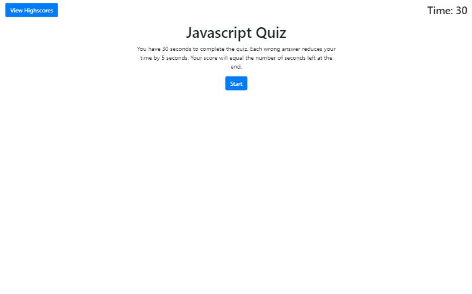

# Code Quiz
This is a basic Javascript quiz.

 
 

## Internet Address

https://benjdg.github.io/04_Code_Quiz/

 
 

## Screenshot

 
 

## Usage

Click on the start button and answer the questions.  You have 30 seconds to finish the quiz.  Every wrong answer will reduce the time by 5 seconds.  Enter your name to record your highscore at the end.

 
 

## Contributing

Pull requests are welcome. For major changes, please open an issue first to discuss what you would like to change.

Please make sure to update tests as appropriate.

 
 

## License
[MIT](https://choosealicense.com/licenses/mit/)

